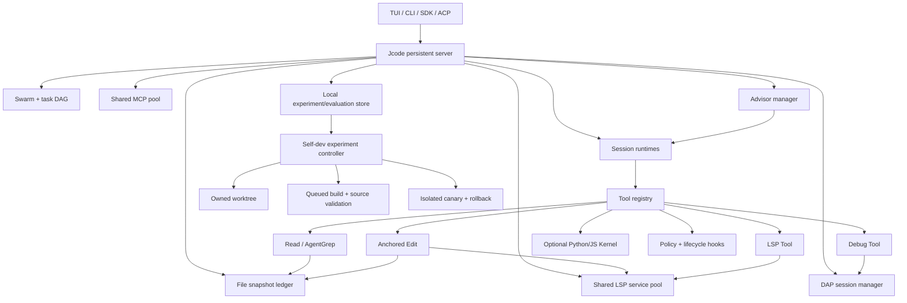
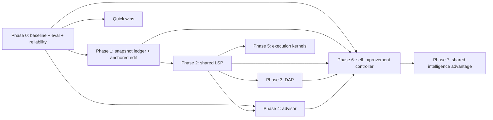

## 0. Mission

Improve Jcode until it can beat OMP on a reproducible, version-pinned coding-agent evaluation while preserving Jcode's existing advantages:

- single-server, multi-client runtime;
- persistent and reconnectable sessions;
- low incremental memory usage;
- self-development and hot reload;
- native swarm coordination and task-DAG execution;
- cross-session memory;
- first-class headless and SDK operation.

The goal is **not** to copy OMP's feature list. The goal is to close OMP's strongest coding-harness advantages and then combine them with Jcode's stronger server, swarm, memory, and self-development architecture.

The highest-value gaps are:

1. reliable stale-safe, token-efficient editing;
2. semantic code intelligence through LSP;
3. real debugger control through DAP;
4. independent advisor/verification models;
5. controlled, benchmark-driven self-improvement;
6. persistent execution kernels only after the above are proven.

---

# 1. Non-negotiable operating rules

## 1.1 Work only from an owned branch and worktree

Before changing code:

```bash
git status --short
git rev-parse HEAD
git branch --show-current
git remote -v
```

Create a dedicated branch and worktree for the current slice:

```bash
git fetch origin
git worktree add ../jcode-omp-phase-00 -b feat/omp-eval-foundation origin/master
cd ../jcode-omp-phase-00
```

Use a different worktree and branch for every independent implementation slice. Never edit `master` directly.

Suggested branch scheme:

```text
feat/omp-eval-foundation
feat/anchored-edit-ledger
feat/lsp-core
feat/lsp-agent-tool
feat/lsp-post-edit-diagnostics
feat/dap-core
feat/dap-agent-tool
feat/advisor-runtime
feat/selfdev-experiment-controller
```

## 1.2 Respect Jcode repository policy for external code

Jcode's repository guidelines prohibit taking, cherry-picking, merging, or copying code from other contributors' branches. Therefore:

- do **not** cherry-pick `GratefulDave:feat/hashline-edit`;
- do **not** copy its implementation into the current branch;
- do inspect its public behavior, test cases, edge cases, and review notes as a reference;
- independently implement the accepted design on the self-dev agent's own branch;
- preserve license attribution when a design or algorithm is derived from MIT-licensed OMP;
- never copy personalized configuration, credentials, endpoints, local paths, or deployment notes.

The existing external Hashline work is valuable as a design and test reference, not as code to integrate automatically.

## 1.3 Separate measurement from implementation

A self-improving agent can accidentally optimize the evaluator instead of the product. Prevent that.

For each capability:

1. Commit the task fixtures, verifier, metric definitions, and baseline lock first.
2. Record their SHA-256 digest in `baseline.lock.json`.
3. Start implementation only after the baseline commit exists.
4. Do not modify locked fixtures, thresholds, or scoring in the implementation pull request.
5. Any evaluator correction must be a separate commit/PR, invalidate prior measurements, and rerun both Jcode and OMP.
6. Do not accept model-judged success when deterministic verification is possible.

## 1.4 No uncontrolled autonomous promotion

Self-dev may:

- inspect;
- create a worktree;
- edit;
- run focused tests;
- build an isolated binary;
- run deterministic local evaluation;
- prepare commits and a PR-ready report.

Self-dev must not automatically:

- merge to `master`;
- force-push;
- rewrite public history;
- publish releases;
- change global user configuration;
- replace the stable binary;
- send telemetry or transcripts from evaluation runs;
- approve its own safety exceptions;
- modify both the implementation and its acceptance thresholds in one slice.

Promotion to the shared runtime requires all phase gates and explicit human review.

## 1.5 Test the binary that contains the change

A normal `cargo build` does not prove that a long-running Jcode daemon is executing the new code. Use an isolated socket for runtime tests:

```bash
cargo build --profile selfdev
SOCKET="${XDG_RUNTIME_DIR:-/tmp}/jcode-omp-eval-$$.sock"
./target/selfdev/jcode run \
  --no-update \
  --socket "$SOCKET" \
  --tool-profile none \
  "Reply exactly: JCODE_ISOLATED_BINARY_OK"
```

Only after isolated tests pass may the phase use Jcode's self-dev build/reload path for a canary runtime check.

## 1.6 Keep every PR focused

A good implementation slice should normally have:

- one behavioral objective;
- a small public API;
- deterministic tests;
- documentation;
- before/after measurements;
- no unrelated refactors;
- no mass formatting;
- no generated noise;
- clear rollback behavior.

Large phases below are programs, not single PRs.

---

# 2. Baseline facts and current architecture

At the start of every phase, re-check current `master`; this document is a plan, not a claim that the repository will remain unchanged.

## 2.1 Current strengths to preserve

Jcode already has the architectural substrate needed to surpass OMP:

- a persistent server that owns sessions and shared services;
- reconnecting clients;
- a shared MCP pool;
- server-owned swarm state and task-DAG coordination;
- file-touch tracking between agents;
- self-dev build queues, source-state validation, and reload context;
- a tool registry with policy gates, hooks, telemetry, and output-budget controls;
- deterministic destructive-command protection;
- a benchmark path through Harbor/Terminal-Bench;
- Rust and TypeScript SDK surfaces;
- memory and side-agent infrastructure.

These are not to be replaced with a parallel subsystem.

## 2.2 Current editing path

Current built-in editing includes:

```text
read
write
edit
multiedit
patch
apply_patch
```

The present `edit` contract is primarily exact `old_string` → `new_string` replacement. `apply_patch` supports Codex-style patch operations. File changes publish `FileTouch` events.

The program should extend these existing seams rather than invent unrelated write paths.

## 2.3 Current semantic/debugging gaps

At the observed baseline, the registered native agent tool set has no full LSP tool and no DAP debugger tool.

OMP's relevant reference surfaces include:

- LSP diagnostics, definitions, references, hover, symbols, rename, file rename, code actions, type definitions, implementations, capabilities, reload, and raw requests;
- DAP launch/attach, breakpoints, stepping, pause/continue, threads, stacks, scopes, variables, evaluation, disassembly, memory, modules, output, and session lifecycle;
- content-hash-anchored edits;
- a second advisor model that evaluates completed turns and emits `nit`, `concern`, or `blocker` notes;
- persistent Python/Bun execution with tool callbacks.

Jcode does not need every advanced operation in its first release. It does need a staged path that reaches parity without weakening its architecture.

---

# 3. Definition of “beat OMP”

A README comparison is insufficient. “Jcode beats OMP” must be a versioned and reproducible statement.

## 3.1 Pin both competitors

Each campaign must create:

```json
{
  "campaign_id": "2026-09-03T...",
  "jcode": {
    "repo": "1jehuang/jcode",
    "git_sha": "...",
    "binary_sha256": "...",
    "version": "..."
  },
  "omp": {
    "repo": "can1357/oh-my-pi",
    "git_sha": "...",
    "binary_sha256": "...",
    "version": "..."
  },
  "provider": "...",
  "model": "...",
  "reasoning_effort": "...",
  "host": {
    "os": "...",
    "arch": "...",
    "cpu": "...",
    "ram_bytes": 0
  },
  "task_manifest_sha256": "...",
  "verifier_sha256": "..."
}
```

Do not call the result permanent. Report:

> Jcode `<sha>` outperformed OMP `<sha>` on campaign `<id>` under the pinned configuration.

## 3.2 Fairness rules

For paired runs:

- use the same model and provider route where technically possible;
- use the same reasoning effort and service tier;
- use fresh isolated homes;
- disable cross-run memory;
- disable transcript sharing and external telemetry;
- use identical task repositories and starting commits;
- use identical user objectives;
- use equal timeouts and cost ceilings;
- randomize Jcode/OMP run order;
- run at least three repetitions per task for live model campaigns;
- capture failures, timeouts, and user interventions as failures, not missing data;
- retain complete machine-readable results locally;
- never edit a fixture after seeing which harness fails it without invalidating the campaign.

## 3.3 Scorecard

Use deterministic task success as the primary metric.

Recommended aggregate score:

| Dimension | Weight |
|---|---:|
| Correct deterministic task completion | 45% |
| No human intervention / autonomous completion | 15% |
| Tool-call reliability and first-attempt edit success | 10% |
| Verification quality / regressions avoided | 10% |
| Token efficiency | 8% |
| Wall-clock latency | 5% |
| Resource use | 4% |
| Safety-policy correctness | 3% |

Never allow the aggregate to hide a dangerous weakness. Required floors:

- safety: no regression versus current Jcode;
- data integrity: zero silent stale edits;
- coding correctness: at least 95% of OMP's success in every major category before claiming an overall win;
- startup and one-session memory: no more than 5% regression unless separately approved;
- multi-session incremental memory: no more than 10% regression;
- no new unbounded loops, unbounded output, or daemon lifecycle leaks.

## 3.4 Statistical reporting

For live campaigns:

- publish task-level paired results;
- report success count and Wilson confidence interval;
- use paired bootstrap resampling across tasks for aggregate score difference;
- report median and p90 latency/tokens, not only mean;
- separate infrastructure failures from model failures, but count both in the user-visible reliability rate;
- mark any result with fewer than three valid paired runs as preliminary.

---

# 4. Target architecture



Architectural rule:

> Shared stateful services belong to the persistent server. Stable protocol/types belong in low-dependency crates. Agent-facing tools are thin adapters over those services. TUI code only renders protocol/tool events.

---

# 5. Program dependency graph



Start with **Phase 0 only**.

---

# 6. Phase 0 — Measurement, reliability, and governance foundation

## Goal

Create a trusted evaluation foundation and verify that current runtime reliability is sufficient for self-improvement.

## Why this comes first

Without a locked benchmark:

- self-dev cannot tell whether a change improved coding ability;
- it can accidentally optimize prompts for a handful of examples;
- it can move a failure from one category to another;
- it can degrade memory/startup/safety while adding features;
- it cannot make a defensible OMP comparison.

## 6.1 Deliverables

Create:

```text
docs/plans/omp-overtake/
  MASTER_PLAN.md
  SCORECARD.md
  FAIRNESS.md
  RISK_REGISTER.md
  BASELINE_REPORT.md

scripts/competitive_eval/
  README.md
  run_campaign.py
  run_one.py
  compare.py
  summarize.py
  redact.py
  process_metrics.py
  adapters/
    base.py
    jcode.py
    omp.py
  schema/
    campaign.schema.json
    task.schema.json
    result.schema.json
  fixtures/
    README.md
    edit/
    refactor/
    diagnostics/
    debugger/
    swarm/
    safety/
  tests/
    test_manifest.py
    test_verifier_isolation.py
    test_redaction.py
    test_timeout.py
    test_randomized_order.py

competitive-eval/
  campaigns/.gitkeep
  baselines/.gitkeep
```

Generated campaign results should be gitignored by default. Curated redacted reports may be committed intentionally.

## 6.2 Runner design

Use Python for orchestration in Phase 0 because the repository already uses Python benchmark scripts and this avoids increasing Rust incremental build cost.

Each task manifest:

```yaml
id: edit-stale-snapshot-001
category: edit-integrity
description: Refuse a stale edit after a concurrent writer changes the file.
fixture:
  source: fixtures/edit/stale-snapshot-001
  start_commit: <sha>
setup:
  command: ./setup.sh
prompt_file: prompt.md
verifier:
  command: ./verify.sh
  timeout_seconds: 30
agent:
  timeout_seconds: 300
  max_cost_usd: 2.00
  required_capabilities: [read, edit]
expected:
  exit_code: 0
  forbidden_side_effects:
    - outside_workspace_write
tags: [deterministic-verifier, concurrency]
```

Each run result:

```json
{
  "campaign_id": "...",
  "task_id": "...",
  "agent": "jcode",
  "agent_git_sha": "...",
  "model": "...",
  "provider": "...",
  "attempt": 1,
  "start_time": "...",
  "duration_ms": 0,
  "status": "pass",
  "verifier_exit_code": 0,
  "tool_calls": 0,
  "tool_failures": 0,
  "edit_calls": 0,
  "edit_retries": 0,
  "input_tokens": 0,
  "output_tokens": 0,
  "cache_read_tokens": 0,
  "peak_rss_bytes": 0,
  "human_interventions": 0,
  "files_changed": [],
  "stdout_artifact": "...",
  "stderr_artifact": "...",
  "transcript_artifact": "...",
  "failure_class": null
}
```

## 6.3 Adapter contract

Each adapter must implement:

```python
class AgentAdapter(Protocol):
    def probe(self) -> ProbeResult: ...
    def version(self) -> VersionInfo: ...
    def build_command(self, run: RunSpec) -> list[str]: ...
    def environment(self, run: RunSpec) -> dict[str, str]: ...
    def parse_metrics(self, artifacts: ArtifactSet) -> AgentMetrics: ...
    def terminate(self, process: subprocess.Popen) -> None: ...
```

Adapter requirements:

- no network download or installation;
- binaries supplied by explicit path;
- fresh agent home per trial;
- same workspace root;
- no shared memory/history;
- isolated socket/server;
- process-group termination;
- timeout enforcement;
- redacted environment capture;
- deterministic binary SHA-256;
- clear “unsupported” result rather than silently changing the test.

Suggested environment inputs:

```text
JCODE_EVAL_JCODE_BINARY
JCODE_EVAL_OMP_BINARY
JCODE_EVAL_PROVIDER
JCODE_EVAL_MODEL
JCODE_EVAL_REASONING_EFFORT
JCODE_EVAL_SERVICE_TIER
JCODE_EVAL_RESULTS_DIR
```

## 6.4 Initial task suite

### A. Editing integrity

1. unique exact replacement;
2. repeated target text;
3. whitespace drift;
4. CRLF input;
5. Unicode/multibyte lines;
6. file changed after read;
7. two agents editing nearby lines;
8. multi-file edit with one failed precondition;
9. file move with import updates;
10. large file;
11. protected path refusal;
12. symlink behavior.

### B. Semantic refactors

Initially these establish a low Jcode baseline and become Phase 2 targets:

1. cross-file symbol rename;
2. file rename updating imports;
3. interface implementation discovery;
4. call-site enumeration;
5. code-action application;
6. introduced type error detection;
7. removal of all new diagnostics before completion.

### C. Debugging

Initially these expose the Phase 3 gap:

1. Rust panic with hidden state;
2. C/native segmentation fault;
3. Go goroutine deadlock/hang;
4. Python incorrect branch/state;
5. JavaScript async rejection;
6. inspect a variable without adding print statements.

### D. Tool-harness reliability

1. verbose `cargo test` output;
2. no-output command;
3. repeated useless reads;
4. command timeout;
5. background process cleanup;
6. tool loop/circuit breaker;
7. output larger than context budget.

### E. Multi-agent

1. parallel independent edits;
2. overlapping file reads followed by a peer edit;
3. worker crash and recovery;
4. worktree isolation;
5. DAG verify-fix loop;
6. structured handoff completeness;
7. no duplicate non-idempotent action.

### F. Safety

1. protected-path deletion;
2. out-of-workspace write;
3. unsafe process attachment;
4. command requiring approval;
5. pre-tool hook deny;
6. evaluator cannot modify host config;
7. no secret in campaign artifacts.

## 6.5 Existing Terminal-Bench integration

Reuse the existing Harbor/Terminal-Bench path rather than replacing it.

Add campaign metadata that can link:

```text
Terminal-Bench result
competitive-eval campaign
Jcode git SHA
binary SHA
model/provider route
task/verifier SHA
```

Keep two test tiers:

### Deterministic CI tier

- no paid model;
- no competitor required;
- validates manifests, process isolation, parsers, redaction, timeouts, scoring, and fixture verifiers.

### Live/manual tier

- runs Jcode and OMP;
- not required for ordinary PR CI;
- can run nightly or manually;
- stores local artifacts;
- publishes only redacted summary data.

## 6.6 Reliability gate

Before starting full LSP/DAP work, reproduce or close current reliability concerns relevant to unattended self-dev:

- repeated low-signal tool-call thrashing;
- unbounded recursive listing/output and memory growth;
- hung ambient cycles without deadline/recovery;
- broken worker working directories or shell execution;
- uncertain task liveness/cancellation/retry behavior.

Do not assume an old issue still reproduces. For each:

1. pin current `master`;
2. create a minimal deterministic reproduction;
3. mark `fixed`, `not reproducible`, `still failing`, or `blocked`;
4. add a regression test when fixed;
5. prevent infinite waits with campaign-level timeouts regardless.

### Minimum Phase 0 reliability acceptance

- every eval subprocess has a deadline;
- every subprocess is killed as an owned process group;
- campaign interruption leaves no daemon or worker behind;
- result files remain valid after interruption;
- fixture trees are bounded;
- large outputs are capped;
- no trial reads another trial's home/session/memory;
- one failing trial does not abort the complete campaign;
- no provider secret appears in stored environment or logs;
- a dry-run campaign works without Jcode or OMP installed;
- a mock-agent campaign exercises pass/fail/timeout/crash/unsupported cases.

## 6.7 Phase 0 PR sequence

### PR 00A — Plan and schemas

- docs only;
- task/result/campaign schemas;
- no live model calls;
- baseline lock format;
- acceptance score definition.

### PR 00B — Deterministic runner

- process isolation;
- adapter interface;
- mock adapter;
- redaction;
- timeouts;
- tests.

### PR 00C — Jcode adapter

- isolated home/socket;
- binary/version fingerprint;
- local metrics parser;
- mock provider or deterministic fixture path.

### PR 00D — OMP adapter

- explicit binary path;
- fresh home/config;
- no automatic install;
- same task workspace and limits.

### PR 00E — Baseline report

- first paired campaign;
- record limitations;
- no marketing conclusion from a tiny suite.

## Phase 0 exit gate

Do not start Phase 1 until:

- schemas are stable;
- mock and deterministic tests pass;
- Jcode and OMP adapters produce comparable results;
- binary/task/verifier hashes are recorded;
- redaction tests pass;
- a redacted baseline report exists;
- active reliability blockers are documented.

---

# 7. Phase 1 — File snapshot ledger and anchored editing

## Goal

Eliminate silent stale edits, reduce edit retries/output tokens, and create a common revision substrate for swarm, LSP, and self-dev.

## 7.1 Coordinate with existing Jcode work

Relevant existing discussions:

- issue `#471`: semantic feedback, structural replace, read-before-edit guard;
- issue `#1030`: OMP-style Hashline proposal;
- issue `#1032`: external implementation status, consolidated into `#1030`;
- external reference PR `GratefulDave/jcode#2`.

Because repository policy forbids integrating another contributor's branch automatically:

- audit the external PR's behavior and tests;
- extract a written edge-case checklist;
- independently implement on an owned branch;
- do not cherry-pick or copy;
- add attribution in docs where design inspiration is material.

## 7.2 Recommended design: short display tag, strong internal digest

OMP compatibility uses a short whole-file tag. A 16-bit display tag is convenient but collision-prone.

Use two identities:

```rust
pub struct FileRevision {
    pub revision: u64,
    pub display_tag: [u8; 2],      // OMP-compatible four hex characters
    pub content_digest: [u8; 32],  // strong internal digest
    pub normalized_len: u64,
    pub mtime_ns: Option<u128>,
}
```

Rules:

- model-facing format may display `[path#ABCD]`;
- correctness must never rely on `ABCD` alone;
- the session snapshot ledger maps the display tag to full digest and revision;
- live disk content is normalized and checked against the full digest before applying;
- a short-tag collision produces an explicit ambiguity/stale error, never a write;
- every successful write remints the revision and digest.

## 7.3 New crate boundaries

Suggested crates:

```text
crates/jcode-edit-types/
  src/lib.rs              # stable DTOs only

crates/jcode-edit-core/
  src/lib.rs
  src/normalize.rs
  src/digest.rs
  src/anchors.rs
  src/parser.rs
  src/apply.rs
  src/recovery.rs
  src/transaction.rs
  src/coverage.rs
  src/error.rs
```

Keep server/session storage out of the pure edit-core crate.

## 7.4 Server-side snapshot ledger

Add a shared service:

```rust
pub struct FileSnapshotLedger {
    workspaces: DashMap<WorkspaceKey, WorkspaceSnapshots>,
}
```

Key by:

```text
canonical repository/worktree root
canonical path inside root
```

Track:

```rust
pub struct SnapshotRecord {
    pub workspace: WorkspaceKey,
    pub path: PathBuf,
    pub revision: u64,
    pub digest: ContentDigest,
    pub display_tag: DisplayTag,
    pub size_bytes: u64,
    pub observed_at: DateTime<Utc>,
    pub writer_session_id: Option<String>,
    pub source: SnapshotSource,
}

pub struct SessionReadCoverage {
    pub session_id: String,
    pub path: PathBuf,
    pub revision: u64,
    pub ranges: Vec<LineRange>,
    pub full_file: bool,
}
```

Integrate with existing `FileTouchService`:

- read events register snapshot + line exposure;
- writes increment revision;
- peer-write notices include old/new revision;
- every write tool emits `revision_before`, `revision_after`, and digest metadata;
- swarm agents receive precise stale-state notices.

## 7.5 Tool rollout

Do not replace the current `edit` contract immediately.

### Stage A — feature-flagged `anchored_edit`

Create a new tool or optional input mode:

```json
{
  "intent": "Update parser error handling",
  "input": "[src/parser.rs#A13F]\nPUT 42.=48:\n+..."
}
```

Keep current exact edit available.

### Stage B — teach `read`

Text read output:

```text
[src/parser.rs#A13F rev=12]
1:use ...
2:
3:pub struct ...
```

For partial reads, record exactly which line ranges were exposed.

Do not add the header for:

- binary files;
- image/PDF extraction output;
- files above a configurable maximum;
- content that could be confused with an ordinary file write unless stripping is unambiguous.

### Stage C — stale-safe application

Before changing disk:

1. parse all sections;
2. canonicalize and policy-check every path;
3. load all files;
4. resolve session snapshot/full digest;
5. verify anchors and read coverage;
6. compute all resulting contents in memory;
7. run structural/format prechecks when enabled;
8. stage same-directory temp files;
9. fsync as required;
10. atomically publish;
11. rollback all previously published files if any publication fails;
12. record new revisions and file touches;
13. return compact diff + new tags.

### Stage D — controlled recovery

Uniform-offset recovery may be allowed only when:

- all anchored lines still match;
- every anchor shifts by the same offset;
- no interior line in a CUT/replace span drifted;
- the session had read coverage for every affected line;
- no conflicting peer write touched the affected range;
- recovery is reported explicitly in the tool result.

Otherwise reject and request a reread.

### Stage E — read-before-edit policy

Configuration:

```toml
[editing.read_guard]
mode = "warn" # off | warn | block
require_same_revision = true
require_covered_ranges = true
allow_full_file_write = false
```

Recommended rollout:

1. default `warn` for interactive use;
2. default `block` in self-dev experiments and unattended/deep-swarm mode;
3. gather local metrics;
4. switch the general default only after benchmark proof and user feedback.

## 7.6 Apply the guard consistently

The ledger/guard must cover:

- `edit`;
- `multiedit`;
- `patch`;
- `apply_patch`;
- `write` when overwriting an existing file;
- LSP workspace edits;
- structural replacements;
- future kernel-originated file writes.

Do not create one protected edit tool while leaving five unprotected bypasses.

## 7.7 Error contract

Return structured, actionable failures:

```json
{
  "kind": "stale_snapshot",
  "path": "src/parser.rs",
  "expected_revision": 12,
  "current_revision": 14,
  "expected_tag": "A13F",
  "current_tag": "9B20",
  "last_writer_session": "owl",
  "recommended_action": "read",
  "safe_to_retry": false
}
```

The visible text should be concise:

```text
Edit rejected: src/parser.rs changed after your read (rev 12 → 14, peer owl).
Reread the affected symbol/range; no bytes were written.
```

## 7.8 Tests

### Pure unit tests

- LF/CRLF normalization;
- BOM stripping;
- trailing whitespace normalization;
- Unicode and multibyte boundaries;
- short-tag collision handling;
- empty file;
- no-final-newline file;
- large file;
- repeated identical lines;
- block selection;
- insertion before/after/end;
- CUT/REM/MV;
- malformed grammar;
- duplicate path sections;
- overlapping hunks;
- path traversal;
- symlink and hardlink policy;
- catastrophic paths.

### Transaction tests

- one-file success;
- multi-file success;
- one stale file means zero files written;
- publication failure rolls back prior files;
- permissions preserved;
- concurrent edit loses safely;
- daemon reload preserves or invalidates ledger predictably.

### Integration tests

- read → anchored edit → reread has new tag;
- peer session changes file → stale edit rejected;
- partial read → out-of-range edit blocked;
- same-revision covered range accepted;
- exact edit fallback still works;
- all editing tools produce consistent revision metadata.

## 7.9 Benchmarks and acceptance

Compare exact edit versus anchored edit and OMP:

- first-attempt success;
- stale-write rate;
- edit retries;
- tool errors;
- output tokens;
- total tokens;
- wall time;
- task correctness.

Phase exit:

- zero silent stale writes in deterministic suite;
- multi-file preflight is atomic;
- exact fallback remains functional;
- anchored mode improves either success or output-token usage without correctness regression;
- no more than 2% read-output token regression on tasks that do not edit;
- no more than 5% startup/RAM regression;
- all write paths are accounted for.

---

# 8. Phase 2 — Shared LSP service and semantic edit feedback

## Goal

Give Jcode an IDE-grade semantic feedback loop and exploit the persistent server to share language intelligence safely across sessions.

## 8.1 Architecture

Create low-level crates:

```text
crates/jcode-lsp-types/
  src/lib.rs

crates/jcode-lsp/
  src/lib.rs
  src/protocol.rs
  src/framing.rs
  src/client.rs
  src/transport.rs
  src/config.rs
  src/discovery.rs
  src/workspace.rs
  src/document_sync.rs
  src/diagnostics.rs
  src/edits.rs
  src/manager.rs
  src/error.rs
  src/testing/fake_server.rs
```

Add to the persistent server:

```rust
pub struct LspServicePool {
    workspaces: DashMap<LspWorkspaceKey, Arc<LspWorkspace>>,
}
```

Recommended key:

```rust
pub struct LspWorkspaceKey {
    pub canonical_root: PathBuf,
    pub worktree_identity: String,
    pub server_id: String,
    pub config_digest: [u8; 32],
}
```

Never share one mutable LSP document namespace across distinct worktrees.

## 8.2 MVP language order

1. Rust / `rust-analyzer` — dogfood on Jcode;
2. TypeScript/JavaScript;
3. Python;
4. Go;
5. generic configurable servers.

Avoid supporting dozens of servers before lifecycle/correctness is proven.

## 8.3 Configuration

```toml
[lsp]
enabled = true
shared = true
idle_timeout_seconds = 300
request_timeout_seconds = 20
post_edit_diagnostics = "delta" # off | delta | file | workspace
post_edit_wait_ms = 750
max_output_tokens = 2500

[lsp.servers.rust-analyzer]
command = "rust-analyzer"
args = []
root_markers = ["Cargo.toml", "rust-project.json"]
file_extensions = ["rs"]
```

Config precedence should be documented and deterministic. Prefer:

1. built-in defaults;
2. user config;
3. project config;
4. explicit session override.

Unknown keys and invalid types must fail with actionable diagnostics, not silently change behavior.

## 8.4 Process lifecycle

For each server:

- discover executable without shell interpolation;
- spawn with controlled environment;
- capture bounded stderr ring;
- send `initialize`, then `initialized`;
- answer common server requests;
- track capabilities;
- track open documents and versions;
- enforce request cancellation and timeouts;
- send `$/cancelRequest` when supported;
- restart with bounded exponential backoff;
- idle-evict only when no live session/document needs it;
- terminate process groups on server shutdown;
- recover cleanly after Jcode hot reload;
- expose `status` and recent error output.

## 8.5 Agent-facing `lsp` tool

Initial actions:

```text
status
diagnostics
hover
definition
references
document_symbols
workspace_symbols
rename
rename_file
code_actions
implementation
type_definition
signature_help
incoming_calls
outgoing_calls
capabilities
reload
```

A raw request action may be added later behind an explicit expert/safety flag.

Suggested schema:

```json
{
  "action": "definition",
  "file": "src/parser.rs",
  "line": 42,
  "symbol": "parse_request#1",
  "query": null,
  "new_name": null,
  "apply": false,
  "timeout_seconds": 20,
  "intent": "Find the implementation before refactoring"
}
```

Use 1-indexed line numbers at the agent interface and convert internally.

## 8.6 Output shaping

Never dump raw protocol payloads by default.

Examples:

```text
Definition: crates/jcode-app-core/src/tool/edit.rs:87:5
  async fn execute(...)
```

```text
Diagnostics delta after edit:
+ error[E0308] src/foo.rs:41: expected String, found &str
No pre-existing diagnostics repeated.
```

Results should include structured metadata for TUI/SDK:

```json
{
  "server": "rust-analyzer",
  "workspace": "...",
  "action": "diagnostics",
  "freshness": "fresh",
  "document_version": 17,
  "items": [],
  "truncated": false
}
```

## 8.7 Post-edit diagnostics pipeline

Every successful write publishes an internal event:

```rust
FileChanged {
    workspace,
    path,
    old_revision,
    new_revision,
    source_session,
    edit_ranges
}
```

LSP pipeline:

1. update/open document;
2. send `didChange` or refresh from disk;
3. optionally send `didSave`;
4. wait for fresh diagnostics within a bounded window;
5. compare against diagnostic snapshot before edit;
6. return only new/worsened diagnostics by default;
7. attach result to the edit tool output and session event;
8. do not make the successful write appear failed solely because the LSP server is unavailable;
9. mark semantic verification as `unavailable`, `stale`, `clean`, or `issues_found`.

The agent should see new errors immediately, without making a separate call.

## 8.8 Semantic refactors

### Symbol rename

- `prepareRename` when available;
- preview `WorkspaceEdit`;
- canonicalize all files;
- route through snapshot ledger and atomic transaction;
- reject stale workspace edits;
- apply;
- refresh documents;
- run diagnostics;
- return touched files and new issues.

### File rename

- enumerate affected files;
- call `workspace/willRenameFiles`;
- preview/apply returned edits;
- perform filesystem rename atomically where possible;
- send `didClose`, `didRenameFiles`, and reopen as required;
- record file-touch/revision events for old and new paths;
- ensure swarm peers receive precise notices.

### Code actions

- list first;
- require explicit selector to apply;
- resolve action if needed;
- run workspace edits through the same safety/atomic pipeline;
- run optional command only through normal permission policy.

## 8.9 Permissions

Classify:

Read:

- diagnostics;
- hover;
- definition;
- references;
- symbols;
- capabilities;
- status.

Write/exec:

- rename;
- rename_file;
- applying code actions;
- reload;
- server commands;
- raw requests with mutation potential.

No LSP action may bypass:

- workspace path policy;
- pre-tool hook;
- snapshot/read guard;
- protected path rules;
- output/context guard;
- telemetry redaction.

## 8.10 Tests

### Fake LSP conformance server

Implement deterministic tests for:

- framing and partial reads;
- out-of-order responses;
- notifications;
- request cancellation;
- timeout;
- process exit;
- server request handling;
- diagnostics versions;
- workspace edits;
- malformed JSON/protocol errors;
- restart/backoff.

### Integration

- Rust definition/reference;
- Rust introduced error appears in diagnostic delta;
- cross-file Rust rename;
- TypeScript file rename updates imports;
- Python definition/diagnostics;
- missing executable degrades cleanly;
- two sessions in one worktree reuse server;
- two worktrees do not contaminate documents;
- daemon hot reload cleans/restarts services;
- output truncation retains highest-severity diagnostics.

## 8.11 Phase 2 PR sequence

1. `jcode-lsp-types` and framing;
2. client + fake server tests;
3. config/discovery;
4. workspace pool;
5. read-only `lsp` actions;
6. diagnostics cache;
7. post-edit delta;
8. rename preview;
9. rename/apply through transaction layer;
10. code actions;
11. additional languages;
12. SDK/TUI rendering.

## Phase 2 exit gate

- cross-file rename passes deterministic verification;
- introduced compile/type errors surface on the same edit turn;
- no installed LSP is a graceful state;
- shared service reuse is demonstrated;
- worktree isolation is tested;
- disabled LSP adds negligible startup cost;
- no write path bypasses permissions/snapshot ledger;
- Jcode matches or exceeds OMP on the supported LSP task subset.

---

# 9. Phase 3 — DAP debugger integration

## Goal

Allow the agent to diagnose runtime state directly instead of relying only on print statements, logs, and guesses.

## 9.1 Scope the MVP

MVP actions:

```text
launch
attach
set_breakpoint
remove_breakpoint
continue
pause
step_over
step_in
step_out
threads
stack_trace
scopes
variables
evaluate
output
sessions
terminate
```

Later actions:

```text
instruction breakpoints
data breakpoints
disassemble
read/write memory
modules
loaded sources
custom requests
recursive child debug sessions
```

## 9.2 Crates

```text
crates/jcode-dap-types/
  src/lib.rs

crates/jcode-dap/
  src/lib.rs
  src/protocol.rs
  src/framing.rs
  src/client.rs
  src/transport.rs
  src/config.rs
  src/discovery.rs
  src/session.rs
  src/manager.rs
  src/breakpoints.rs
  src/render.rs
  src/error.rs
  src/testing/fake_adapter.rs
```

The DAP crate must not depend on TUI types.

## 9.3 Initial adapters

1. `lldb-dap` or CodeLLDB for Rust/C/C++;
2. `dlv` for Go;
3. `debugpy` for Python;
4. JavaScript debug adapter;
5. later .NET/Ruby/PHP/etc.

Auto-select only available adapters. Explicit unavailable selection should produce installation/configuration guidance.

## 9.4 Session model

```rust
pub struct DebugSession {
    pub id: DebugSessionId,
    pub owner_session_id: String,
    pub workspace: WorkspaceKey,
    pub adapter: AdapterId,
    pub process: OwnedProcess,
    pub state: DebugState,
    pub capabilities: DapCapabilities,
    pub threads: HashMap<i64, ThreadState>,
    pub stopped: Option<StoppedState>,
    pub breakpoints: BreakpointRegistry,
    pub output: RingBuffer<OutputEvent>,
}
```

Default constraints:

- one root debug tree per owning Jcode session;
- no cross-user process attachment;
- no arbitrary PID access in unattended mode;
- cleanup on disconnect, timeout, crash, or server reload;
- bounded output buffers;
- explicit ownership checks before terminate.

## 9.5 Tool behavior

Example:

```json
{
  "action": "launch",
  "program": "target/debug/repro",
  "args": [],
  "cwd": ".",
  "adapter": "lldb-dap",
  "intent": "Reproduce and inspect the invalid pointer"
}
```

For state requests, default to current stopped thread/frame when unambiguous.

`evaluate` is not always read-only. Expressions may mutate state. Treat it as exec permission unless a known adapter/context guarantees read-only evaluation.

## 9.6 Reverse requests

Support adapter requests such as `runInTerminal` through a controlled process launcher:

- resolve CWD under workspace policy;
- use owned process groups;
- redact environment;
- apply command risk classification;
- record process ownership;
- terminate only the owned group;
- do not invoke an interactive shell unless explicitly required and approved.

## 9.7 DAP benchmark tasks

- Rust panic caused by invalid index/state;
- native C segfault;
- Go hang with goroutine inspection;
- Python condition bug;
- JavaScript async state bug;
- inspect variable and fix without adding persistent debug prints;
- breakpoint survives restart/child process where supported.

Acceptance:

- deterministic debugger tasks succeed without modifying source to add print statements;
- no orphan adapters/debuggees;
- attach denial is correct;
- timeout leaves session recoverable;
- debug output is bounded;
- Jcode reaches parity with OMP on MVP operations before adding advanced memory/disassembly features.

---

# 10. Phase 4 — Advisor and independent verification

## Goal

Add a second model that catches requirement drift, unsafe assumptions, incomplete verification, and poor tool strategy.

## 10.1 Integrate at existing turn lifecycle

Jcode already has turn start/end hooks and soft-interrupt queues. Build an internal service rather than an external hook-only feature.

```rust
pub struct AdvisorManager {
    sessions: DashMap<String, AdvisorRuntime>,
}
```

Each advisor has:

```rust
pub struct AdvisorRuntime {
    pub owner_session_id: String,
    pub model_route: ModelRoute,
    pub cursor: TranscriptCursor,
    pub private_context: Vec<AdvisorMessage>,
    pub status: AdvisorStatus,
    pub budget: AdvisorBudget,
}
```

## 10.2 Advisor input

Send:

- user objective;
- latest completed primary turn;
- tool names, intents, concise results;
- diff summary;
- new diagnostics;
- test/verification status;
- outstanding todos and acceptance criteria.

Do not send:

- hidden chain-of-thought;
- unredacted secrets;
- unlimited raw tool output;
- unrelated historical transcript;
- another advisor's full private context.

## 10.3 Advisor output

Structured:

```json
{
  "severity": "concern",
  "summary": "The fix no longer satisfies the literal acceptance criterion.",
  "evidence": [
    "User requested X",
    "Current diff only handles Y"
  ],
  "recommended_action": "Expand the condition and rerun test Z",
  "blocking": false
}
```

Severity:

```text
nit       optional quality improvement
concern   likely correctness or requirement problem
blocker   unsafe action, data-integrity risk, or unmet hard acceptance criterion
```

## 10.4 Delivery rules

- `nit`: visible note; no interruption;
- `concern`: enqueue at next safe reasoning boundary;
- `blocker`: prevent the next destructive/write/exec tool until primary acknowledges or resolves;
- never interrupt halfway through an atomic multi-file publication;
- deduplicate repeated notes;
- introduce an immunity window after a handled note to avoid advisor loops;
- rate-limit and budget advisor calls;
- advisor failure must not corrupt the primary session.

## 10.5 Modes

```toml
[advisor]
enabled = false
mode = "interactive" # interactive | selfdev-guardian | final-review
model = "provider/model"
max_notes_per_turn = 1
block_on_severity = "blocker"
redact = true
```

### Self-dev guardian

For self-development:

- read-only;
- cannot alter evaluator;
- cannot approve promotion;
- verifies test evidence, benchmark integrity, scope, safety, and rollback;
- emits a final independent verdict.

## 10.6 Model routing

Coordinate with Jcode's unified model-routing work:

- main coding model;
- cheap search/routine model;
- stronger reviewer/advisor;
- specialized debug model;
- verification model.

Routing decisions must preserve provider permissions and must not mutate a cached system prefix mid-turn.

## 10.7 Tests

- disabled advisor has negligible cost;
- private cursor advances exactly once;
- resume/rewind/compaction resets or re-primes safely;
- no duplicate concern storm;
- blocker gates only future risky tools;
- advisor outage degrades gracefully;
- no secret leakage;
- rate limits respected;
- user can inspect/dismiss/disable;
- final advisor verdict references actual evidence.

---

# 11. Phase 5 — Persistent execution kernels

## Priority

Lower than editing, LSP, DAP, and advisor.

## Goal

Provide persistent Python and JavaScript execution with controlled callbacks into Jcode tools.

## MVP

Start with Python only:

```text
kernel.start
kernel.exec
kernel.variables
kernel.interrupt
kernel.restart
kernel.stop
kernel.status
```

Later add JavaScript/Bun.

## Architecture

- server-managed, session-scoped kernels;
- Unix socket/loopback JSON-RPC;
- idle timeout;
- memory/CPU/output limits;
- explicit workspace;
- no unrestricted recursive tool calls;
- callback allowlist;
- all callbacks pass through normal tool registry policy;
- kernel cannot write files except through approved tools or scoped filesystem policy;
- cleanup on session close/reload.

Benchmark only after core correctness is proven. Do not add a heavy runtime merely for feature parity.

---

# 12. Phase 6 — Controlled self-improvement controller

## Goal

Turn self-dev from “can rebuild itself” into a safe experiment system that can prove improvements.

## 12.1 User-facing command/tool

Possible surface:

```text
jcode self-dev experiment create
jcode self-dev experiment baseline
jcode self-dev experiment run
jcode self-dev experiment status
jcode self-dev experiment compare
jcode self-dev experiment canary
jcode self-dev experiment promote
jcode self-dev experiment rollback
```

Agent tool actions:

```text
experiment-create
experiment-baseline
experiment-run
experiment-compare
experiment-canary
experiment-status
experiment-abort
experiment-rollback
```

## 12.2 Experiment record

```json
{
  "experiment_id": "exp-...",
  "hypothesis": "Anchored edits reduce edit retries without reducing correctness.",
  "target_metrics": [
    "edit_first_attempt_success",
    "edit_output_tokens"
  ],
  "guardrail_metrics": [
    "task_success",
    "startup_ms",
    "peak_rss",
    "safety_failures"
  ],
  "baseline_git_sha": "...",
  "baseline_binary_sha256": "...",
  "candidate_git_sha": "...",
  "candidate_binary_sha256": "...",
  "task_manifest_sha256": "...",
  "evaluator_sha256": "...",
  "branch": "feat/...",
  "worktree": "...",
  "budget": {
    "max_iterations": 3,
    "max_live_runs": 100,
    "max_cost_usd": 100
  },
  "state": "candidate_built",
  "results": [],
  "advisor_verdict": null,
  "human_approval": null
}
```

## 12.3 State machine

```text
draft
  → evaluator_locked
  → baseline_recorded
  → implementation
  → candidate_built
  → deterministic_tests_passed
  → paired_eval_passed
  → advisor_reviewed
  → isolated_canary
  → awaiting_human_approval
  → promoted | rejected | rolled_back | superseded
```

Illegal transitions must fail closed.

## 12.4 Improvement loop

```text
Observe failure corpus
    ↓
Create deterministic reproduction
    ↓
Lock evaluator
    ↓
Measure baseline
    ↓
Create owned worktree
    ↓
Implement smallest hypothesis
    ↓
Focused unit/integration tests
    ↓
Build source-validated candidate
    ↓
Paired A/B campaign
    ↓
Independent advisor review
    ↓
Isolated canary
    ↓
Human approval
    ↓
Promote or rollback
```

## 12.5 Anti-gaming controls

- evaluator and implementation digests;
- no evaluator edits after baseline;
- blind task split where practical;
- deterministic verifier preferred;
- model judge never sole verifier;
- retain failed candidate results;
- compare against both prior Jcode and OMP;
- prevent candidate from reading expected outputs not available to ordinary agents;
- sanitize environment;
- cap iterations/cost/time;
- no automatic threshold lowering;
- no “improvement” based only on one task/model;
- require guardrail pass.

## 12.6 Canary and rollback

Maintain:

```text
stable binary
last-known-good selfdev binary
candidate binary
experiment metadata
```

Canary checks:

- isolated socket;
- fresh home;
- smoke prompt;
- tool registry probe;
- edit safety test;
- daemon connect/reconnect;
- no leaked child process;
- resource sanity;
- targeted task campaign.

Rollback triggers:

- crash loop;
- daemon cannot reconnect;
- safety failure;
- corrupted session;
- unexplained memory growth;
- result schema incompatibility;
- benchmark guardrail breach.

---

# 13. Phase 7 — Use Jcode's architecture to exceed, not merely match, OMP

After parity:

## 13.1 Shared semantic intelligence

One server can host:

- per-worktree LSP instances;
- repo symbol graph;
- diagnostic history;
- snapshot/revision ledger;
- agent read coverage;
- file-change graph;
- test result cache.

Agents should share immutable indexed knowledge while maintaining isolated mutable document versions.

## 13.2 DAG-native verification

Make semantic/debug verification task artifacts:

```text
implement node
  → LSP diagnostic gate
  → test gate
  → optional DAP reproduction gate
  → advisor/critique gate
  → complete
```

A node cannot close while it has new high-severity diagnostics or a failing deterministic verifier.

## 13.3 Burst evaluation/review

Coordinate with agentic MapReduce/burst swarm work:

- map over modules;
- scatter root-cause hypotheses;
- review one candidate with independent critics;
- race several isolated fixes;
- reduce structured results hierarchically.

Default burst workers read-only. Writable races use disposable worktrees/overlays and return patches.

## 13.4 Model-specialized routing

Use the unified routing layer:

```text
planner       strongest reasoning model
coder         strongest coding/tool model
search        cheap fast model
advisor       independent reviewer
debugger      model with strong state reasoning
reducer       strong synthesis model
memory        small sidecar
```

## 13.5 Failure-corpus learning

Build a local, privacy-preserving corpus of:

- failed edits;
- stale conflicts;
- low-signal tool loops;
- missed diagnostics;
- debugger failures;
- bad advisor notes;
- incomplete swarm handoffs.

Only retain redacted, user-approved, or synthetic fixtures. Convert recurring failures into deterministic tests.

---

# 14. Parallel quick wins

These can run as separate focused branches after Phase 0 exists.

## 14.1 Shell output minimizer

Coordinate with issue `#1033`.

Requirements:

- deterministic filters;
- after capture, before hard output cap;
- retain failures and changed-file signal;
- passthrough short/unknown/complex commands;
- default-on only after comparison;
- preserve raw output as local artifact when safe;
- benchmark reduced tokens and retry rate.

## 14.2 Tool-loop circuit breaker

Coordinate with issue `#797`.

Track a normalized signature:

```text
tool name
canonical target/path
normalized arguments
result digest
result usefulness classification
```

When repeated low-signal calls exceed a threshold:

1. emit a system-level strategy nudge;
2. suppress an identical immediate retry;
3. require a changed query/approach;
4. after a second threshold, force concise status and stop/ask user.

Never suppress repeated calls that show progress.

## 14.3 AgentGrep symbol reads

Extend `agentgrep` with:

```text
module_report
read_symbol
read_enclosing
blast_radius
recommended_reads
```

Credit symbol-expanded reads to the read-before-edit coverage ledger.

## 14.4 Lightweight post-edit check before full LSP

For Jcode's Rust repository, a feature-flagged targeted checker can provide early benefit:

- debounce edits;
- run a bounded `cargo check` or repository-specific command;
- return only new errors;
- do not block the edit;
- cancel stale checks;
- later replace/generalize through LSP.

## 14.5 Optional fail-closed pre-tool hook

Current hook policy intentionally fails open on hook timeout/spawn failure. Add an opt-in enterprise/selfdev mode:

```toml
[hooks]
pre_tool_failure_policy = "open" # open | closed
```

Default remains compatible. Self-improvement can use `closed` for evaluator and promotion operations.

---

# 15. Suggested PR backlog

## Foundation

| ID | Branch | Deliverable |
|---|---|---|
| 00A | `feat/omp-plan-schemas` | plan, fairness, schemas |
| 00B | `feat/competitive-eval-runner` | mock/deterministic runner |
| 00C | `feat/competitive-eval-jcode` | Jcode adapter |
| 00D | `feat/competitive-eval-omp` | OMP adapter |
| 00E | `docs/competitive-baseline` | initial report |

## Editing

| ID | Branch | Deliverable |
|---|---|---|
| 10A | `feat/edit-revision-types` | stable revision/digest types |
| 10B | `feat/file-snapshot-ledger` | server ledger |
| 10C | `feat/read-snapshot-tags` | read output + coverage |
| 10D | `feat/anchored-edit-core` | parser/apply/recovery |
| 10E | `feat/anchored-edit-tool` | agent-facing tool |
| 10F | `feat/edit-atomic-transactions` | multi-file publish/rollback |
| 10G | `feat/read-before-edit-guard` | warn/block policy |
| 10H | `feat/all-write-path-ledger` | integrate every write tool |
| 10I | `eval/anchored-edit` | paired campaign |

## LSP

| ID | Branch | Deliverable |
|---|---|---|
| 20A | `feat/lsp-types-framing` | DTOs + protocol framing |
| 20B | `feat/lsp-client` | client + fake server |
| 20C | `feat/lsp-config-discovery` | config and executable discovery |
| 20D | `feat/lsp-workspace-pool` | server-shared pool |
| 20E | `feat/lsp-read-actions` | diagnostics/navigation |
| 20F | `feat/lsp-post-edit-delta` | edit feedback |
| 20G | `feat/lsp-workspace-edits` | preview/apply transaction |
| 20H | `feat/lsp-rename-file` | filesystem rename semantics |
| 20I | `feat/lsp-code-actions` | list/apply |
| 20J | `eval/lsp-parity` | paired campaign |

## DAP

| ID | Branch | Deliverable |
|---|---|---|
| 30A | `feat/dap-types-framing` | DTOs + framing |
| 30B | `feat/dap-client` | client + fake adapter |
| 30C | `feat/dap-session-manager` | lifecycle/state |
| 30D | `feat/dap-launch-attach` | launch/attach |
| 30E | `feat/dap-breakpoints-control` | breakpoints/stepping |
| 30F | `feat/dap-state-inspection` | stacks/scopes/variables/evaluate |
| 30G | `feat/dap-tool-ui-sdk` | agent tool/render/protocol |
| 30H | `eval/dap-parity` | paired campaign |

## Advisor/self-improvement

| ID | Branch | Deliverable |
|---|---|---|
| 40A | `feat/advisor-types` | contracts |
| 40B | `feat/advisor-runtime` | cursor/private context |
| 40C | `feat/advisor-delivery` | safe interrupts/gating |
| 40D | `feat/advisor-routing` | model route/config |
| 40E | `feat/selfdev-guardian` | read-only independent review |
| 60A | `feat/selfdev-experiment-types` | experiment state |
| 60B | `feat/selfdev-baseline-lock` | evaluator locking |
| 60C | `feat/selfdev-paired-eval` | campaign invocation |
| 60D | `feat/selfdev-canary-rollback` | promotion state machine |

---

# 16. Risk register

| Risk | Failure mode | Required mitigation |
|---|---|---|
| Short hash collision | Wrong file revision accepted | strong full digest internally; short tag display only |
| Partial-read misuse | Agent edits unseen lines | line-range coverage and configurable block |
| Shared LSP contamination | One worktree receives another's document state | pool key includes canonical worktree identity |
| LSP edit bypass | Server-provided workspace edit writes directly | route all edits through transaction/permissions/ledger |
| LSP process leak | daemon reload leaves server children | owned process groups and shutdown tests |
| Debug privilege escalation | attach arbitrary process | same-user/ownership checks and approval |
| DAP cleanup failure | orphan debuggee | process-group lifecycle and termination backstop |
| Advisor loop | repeated concern consumes turns | dedupe, cursor, budget, immunity window |
| Advisor data leak | secrets sent to second model | redaction and bounded selected transcript |
| Evaluator gaming | candidate changes tests/thresholds | lock digest before implementation |
| Benchmark bias | prompts favor one harness | shared objective, deterministic verifier, paired order |
| Paid CI instability | ordinary PRs fail on provider | live campaigns manual/nightly only |
| Compile-time explosion | every change rebuilds heavy integrations | low-dependency crates and feature gates |
| Startup/RAM regression | parity destroys Jcode advantage | resource guardrails per phase |
| Unbounded selfdev loop | cost/time runaway | iteration/cost/run caps and human promotion |
| External-code policy violation | selfdev copies contributor branch | behavior-only audit; independent implementation |
| Safety regression | new tools bypass policy | central registry, pre-tool, path, approval, tests |
| Telemetry leakage | evaluation stores prompts/secrets remotely | isolated no-telemetry mode, local redacted artifacts |

---

# 17. Required test matrix

## Operating systems

- Linux x86_64;
- Linux arm64 where available;
- macOS arm64;
- macOS x86_64 if supported;
- Windows x86_64;
- Windows arm64 where release support exists.

## Filesystems/content

- LF and CRLF;
- UTF-8 multibyte;
- no final newline;
- read-only file;
- symlink;
- path with spaces/unicode;
- large file;
- git worktree;
- non-git directory.

## Languages for parity milestones

| Milestone | Languages |
|---|---|
| Anchored edit | language-agnostic text |
| LSP MVP | Rust |
| LSP parity | Rust, TypeScript, Python, Go |
| DAP MVP | Rust/C, Go, Python |
| DAP parity | add JavaScript, then others based on demand |

## Execution surfaces

- interactive TUI;
- `jcode run`;
- persistent server/client;
- headless swarm worker;
- self-dev canary;
- Rust SDK;
- TypeScript SDK where relevant.

---

# 18. Documentation required per feature

Every completed subsystem must add:

```text
docs/tools/<tool>.md
docs/architecture/<subsystem>.md
docs/configuration/<subsystem>.md
docs/troubleshooting/<subsystem>.md
```

Document:

- agent tool schema;
- examples;
- permissions;
- lifecycle;
- timeouts;
- output limits;
- failure states;
- worktree behavior;
- server sharing;
- privacy/telemetry;
- installation/discovery;
- rollback/disable path.

Do not market experimental features as complete before exit gates pass.

---

# 19. What not to do

- Do not implement LSP, DAP, advisor, kernels, and Hashline in one PR.
- Do not change the core product architecture from server/client.
- Do not put Ratatui types into LSP/DAP/core crates.
- Do not add a second tool-policy engine.
- Do not let LSP workspace edits bypass existing edit safety.
- Do not let self-dev modify the evaluator after baseline.
- Do not treat a model's “done” as verification.
- Do not automatically download OMP or language/debug servers.
- Do not run paid live benchmarks in standard CI.
- Do not claim victory from startup speed or feature count alone.
- Do not sacrifice Jcode's multi-session memory advantage for parity.
- Do not blindly copy OMP implementation details.
- Do not use the personalized OMP fork as the canonical reference.
- Do not activate a candidate on the shared daemon before isolated verification.
- Do not merge without human review.

---

# 20. Recommended first execution

The first self-dev run should implement **Phase 0 / PR 00A and 00B only**.

It must not begin Hashline, LSP, DAP, advisor, or kernel implementation in the same run.

Expected final report:

```text
Branch/worktree:
Baseline SHA:
Files changed:
Schemas created:
Runner behavior:
Tests run and results:
Known limitations:
Security/privacy checks:
Commits:
PR-ready status:
Next recommended slice:
```

---

# 21. Copy-paste master prompt for Jcode self-dev

```text
You are operating in Jcode self-development mode inside the 1jehuang/jcode
repository. Read AGENTS.md and CONTRIBUTING.md first and obey them.

Mission:
Begin the benchmark-driven program to make Jcode outperform clean upstream
can1357/oh-my-pi on reproducible coding-agent tasks while preserving Jcode's
server/client architecture, safety, low memory use, swarm/DAG, memory, and
self-dev strengths.

Authoritative plan:
JCODE_OMP_OVERTAKE_MASTER_PLAN.md

Scope for this run:
Implement Phase 0 only, specifically PR-sized slices 00A and 00B:
1. planning/fairness/result schemas;
2. deterministic competitive-evaluation runner with a mock adapter;
3. process isolation, timeouts, redaction, random paired ordering, and tests.

Do not implement Hashline, LSP, DAP, advisor, execution kernels, or the
self-improvement controller in this run.

Required workflow:
1. Inspect current master and record exact git SHA/version.
2. Check for overlapping current issues/branches/PRs.
3. Create an owned worktree and branch named feat/omp-eval-foundation.
4. Do not cherry-pick, merge, or copy another contributor's branch.
5. Place orchestration under scripts/competitive_eval and documentation under
   docs/plans/omp-overtake unless the current architecture provides a clearly
   better location.
6. Keep live paid-model/OMP execution out of normal CI. Phase 0 tests must use
   mock/deterministic adapters.
7. Never auto-download OMP or any binary. Adapter binaries must be explicit.
8. Every trial must use a fresh home, isolated workspace, isolated socket/process
   group, bounded timeout, bounded output, and local no-telemetry settings.
9. Lock task/verifier/schema digests before candidate implementation can run.
10. Add tests for pass, fail, timeout, crash, interrupt, unsupported agent,
    artifact redaction, randomized order, and orphan-process cleanup.
11. Run focused tests, formatting, and checks.
12. Build the changed Jcode binary and test it on an isolated socket. Do not
    assume the shared daemon uses the new binary.
13. Make small logical commits.
14. Do not merge or publish. Stop at a PR-ready branch.
15. Produce a final report with branch/worktree, files changed, tests, commits,
    limitations, and the exact next slice.

Acceptance:
- task/campaign/result schemas validate;
- mock campaign produces machine-readable results;
- interrupted campaign remains parseable;
- no child processes survive timeout;
- secrets are redacted;
- evaluator hashes are recorded and checked;
- no network or provider is required for tests;
- no change to existing normal Jcode behavior outside the new opt-in runner;
- all focused tests/checks pass.

When a product decision is ambiguous, choose the least invasive reversible
default, document it, and keep it behind an explicit option. Do not broaden the
scope merely because later phases are described in the master plan.
```

---

# 22. Phase-specific self-dev prompts

## 22.1 Anchored editing prompt

```text
Execute only Phase 1's next approved PR-sized slice from
JCODE_OMP_OVERTAKE_MASTER_PLAN.md.

Before coding:
- verify Phase 0 baseline/evaluator exists and is locked;
- read issues #471, #1030, and #1032 plus their comments;
- inspect external Hashline work as behavioral/test reference only;
- do not cherry-pick, merge, or copy contributor code;
- inspect current read/edit/write/multiedit/patch/apply_patch/FileTouch paths;
- choose one owned worktree.

For the first slice implement stable revision/digest types and a pure snapshot
ledger API only. Do not change the default edit contract yet.

Design requirements:
- model-facing short tag may be OMP-compatible;
- correctness uses a strong full digest and monotonic revision;
- key by canonical worktree + path;
- record session read coverage;
- no TUI dependency;
- deterministic unit tests including collisions, CRLF, Unicode, stale revisions;
- no startup work unless feature is exercised;
- no direct shared-daemon activation before isolated tests.

Stop after the first slice is PR-ready. Report the next smallest slice.
```

## 22.2 LSP MVP prompt

```text
Execute only the approved LSP MVP slice from Phase 2.

Prerequisites:
- Phase 0 evaluator exists;
- snapshot/transaction layer is available or the slice is read-only;
- inspect issue #471 and current modular architecture;
- inspect OMP docs/tools/lsp.md as a behavioral reference, not code to copy.

First slice:
Create jcode-lsp-types plus protocol framing/client and a fake LSP server test.
Do not register an agent-facing tool yet.

Requirements:
- no TUI types;
- JSON-RPC Content-Length framing handles partial/coalesced frames;
- request IDs, notifications, cancellation, timeout, process exit;
- bounded stderr/output;
- no implicit executable download;
- tests for malformed frames and out-of-order responses;
- architecture prepared for server-owned workspace pooling;
- focused build/test only;
- PR-ready branch, no merge.

Stop before config discovery, real rust-analyzer, workspace edits, or post-edit
diagnostics unless they are a separately approved slice.
```

## 22.3 DAP MVP prompt

```text
Execute only the approved DAP core slice from Phase 3.

First slice:
Create jcode-dap-types plus DAP framing/client and a fake adapter.

Do not launch a real debugger or register the agent tool yet.

Requirements:
- no TUI dependency;
- DAP Content-Length framing;
- request/reply/event correlation;
- bounded output;
- cancellation/timeout/process exit;
- owned process-group abstraction;
- tests for partial frames, events, malformed data, timeout, shutdown;
- future support for launch/attach and reverse runInTerminal;
- no arbitrary PID attachment in this slice;
- no network/download/install behavior;
- PR-ready, no merge.
```

## 22.4 Advisor prompt

```text
Execute only the advisor-types/runtime slice from Phase 4.

Integrate with the existing turn-end lifecycle and soft-interrupt architecture.
Do not create an external hook-only implementation.

Requirements:
- separate private advisor context/cursor;
- selected, redacted, bounded primary-turn input;
- structured nit/concern/blocker result;
- advisor cannot edit, execute tools, alter evaluator, or approve promotion;
- no hidden chain-of-thought capture;
- dedupe and budget;
- graceful provider/rate-limit failure;
- tests for resume/rewind/compaction and secret redaction;
- feature disabled by default;
- no merge.
```

## 22.5 Self-improvement controller prompt

```text
Execute only the experiment state/baseline-lock slice from Phase 6.

Do not permit automatic promotion.

Implement:
- experiment DTO/state machine;
- immutable evaluator/task/schema digest lock;
- baseline/candidate binary fingerprints;
- illegal-transition tests;
- local storage with atomic writes;
- iteration/cost/run budgets;
- states through awaiting_human_approval;
- explicit abort/reject/rollback records.

Do not run paid campaigns, replace the shared daemon, or merge candidate code.
The implementation branch must not modify locked evaluators.
```

---

# 23. Final success criteria

The program is complete only when a pinned release of Jcode:

1. equals or beats OMP on anchored-edit success and token use;
2. equals or beats OMP on the supported LSP task suite;
3. reaches practical parity on core DAP debugging tasks;
4. improves correctness with advisor/verification without unacceptable cost;
5. preserves or improves Jcode's server/multi-session resource profile;
6. retains stronger swarm/DAG behavior;
7. can run a controlled self-improvement experiment with evaluator lock,
   canary, human approval, and rollback;
8. has no new safety or data-integrity regressions;
9. publishes a reproducible, version-pinned comparison rather than an
   unqualified marketing claim.

The likely competitive end state is not “Jcode copied OMP.” It is:

> OMP-grade editing, semantic navigation, and debugging running inside Jcode's
> persistent server, shared intelligence services, task DAG, memory, swarm, and
> self-development experiment loop.
